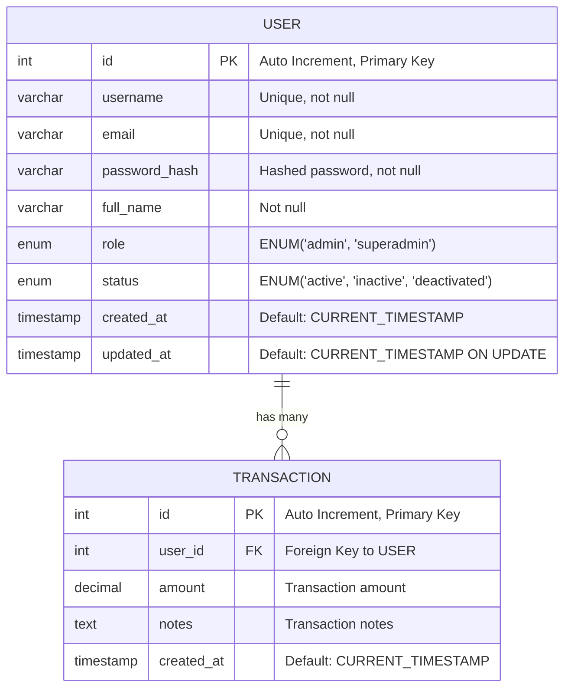

# User-Api

The **User API** is a Spring Boot microservice that manages admin users, providing functionality to add, activate, and deactivate them. It also supports viewing a list of all users. The service uses **JWT authentication** and **role-based access control (RBAC)** to ensure secure user management.

## Features

- **User Management:** Create, retrieve, update, and deactivate users.
- **Authentication & Authorization:** JWT-based authentication with role-based access (`admin`, `superadmin`).
- **Transaction Tracking:** Each admin user has an associated transaction history.
- **Integration:** Designed to integrate with other microservices like `notification-api`.

## Tech Stack

- **Spring Boot 3** (REST API)
- **Spring Security & JWT** (Authentication & Authorization)
- **MySQL** (Database)
- **JPA/Hibernate** (ORM)
- **Docker** (Containerization)
- **Swagger/OpenAPI** (API Documentation)

## Entity Relationship Diagram (ERD)

The database schema for the `user-api` consists of two main tables: `USER` and `TRANSACTION`. These tables manage admin users and their related transactions.



## Installation

### Prerequisites

- JDK 17+
- Maven
- MySQL
- Docker (optional)

### Steps

1. Clone the repository:
   ```sh
   git clone https://github.com/yourusername/user-api.git
   cd user-api
   ```
2. Configure the database in `application.properties`:
   ```properties
   spring.datasource.url=jdbc:mysql://localhost:3306/userdb
   spring.datasource.username=root
   spring.datasource.password=yourpassword
   ```
3. Build and run:
   ```sh
   mvn clean install
   mvn spring-boot:run
   ```

## Authentication

This API uses JWT for authentication. To access protected endpoints:

1. Obtain a JWT token via login (`/auth/login`).
2. Include the token in the `Authorization` header of API requests:
   ```http
   Authorization: Bearer your-jwt-token
   ```


## Running with Docker

You can run the application with Docker:

```sh
docker build -t user-api .
docker run -p 8080:8080 user-api
```
